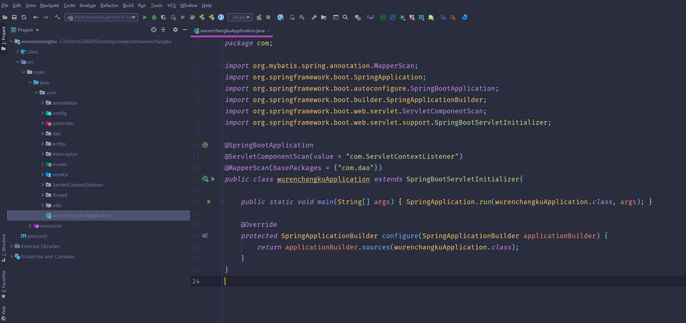
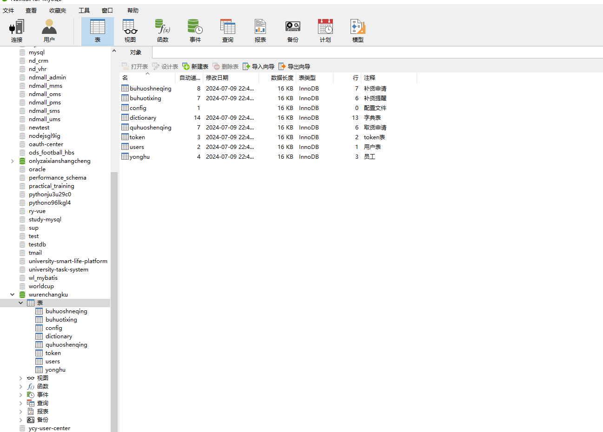
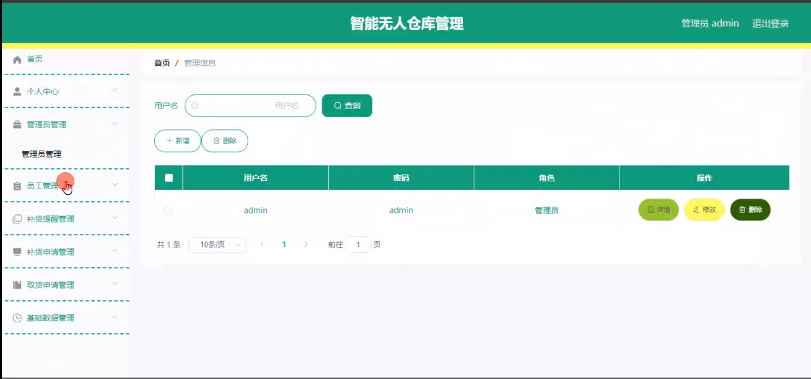
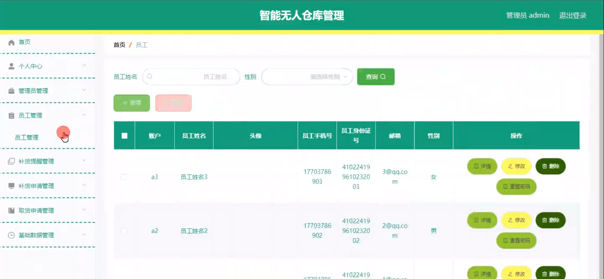
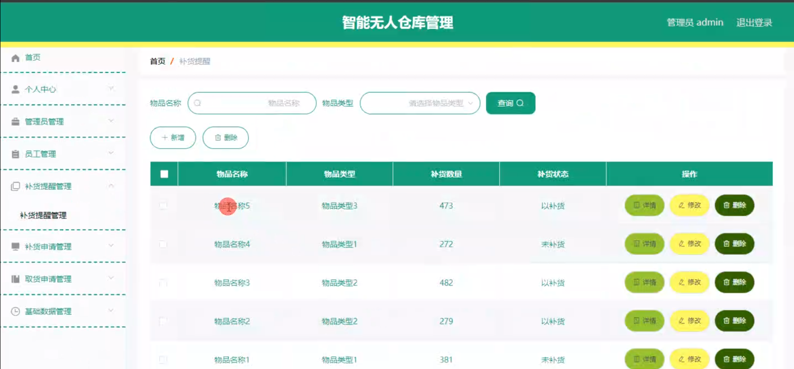
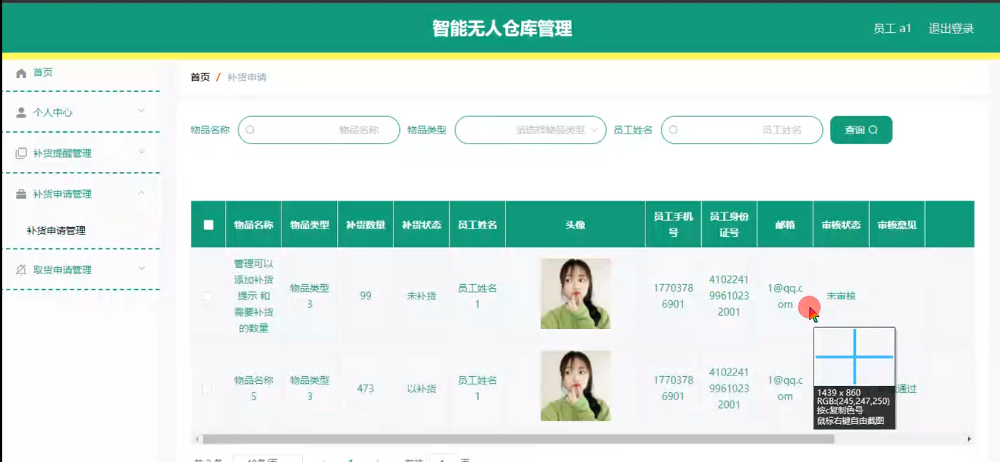
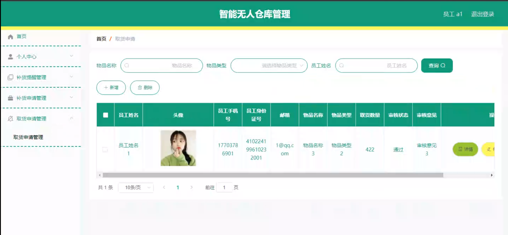
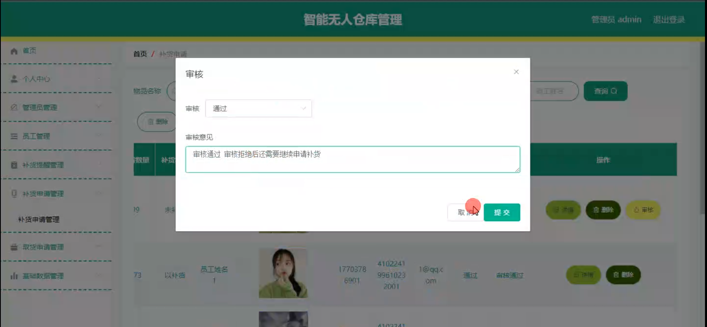
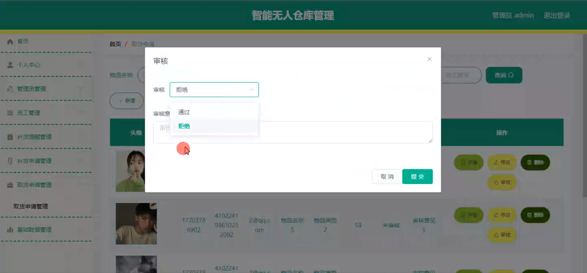
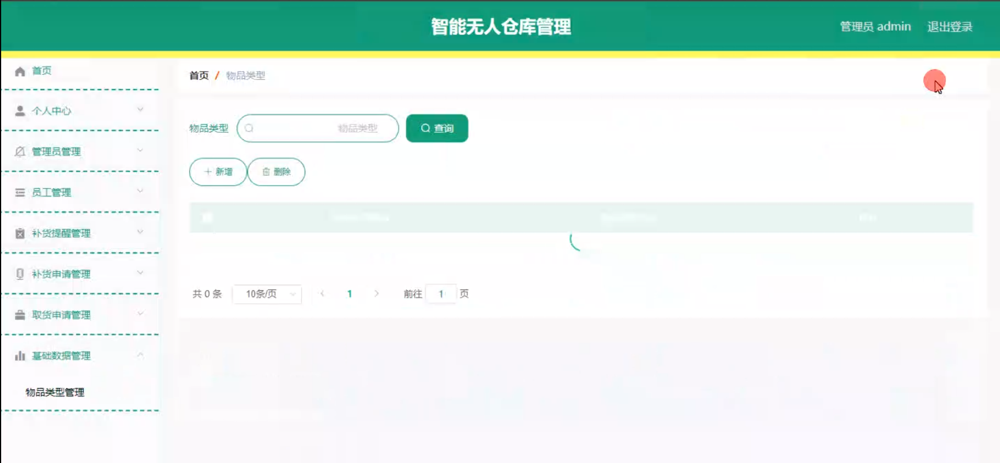

# 基于SpringBoot的智能无人仓库管理

---
### 👉作者QQ ：1556708905 微信：zheng0123Long (支持定制修改、部署调试、定制毕设)

### 👉接网站建设、小程序、H5、APP、各种系统等

---

#### 介绍

在现代物流和仓储行业中，高效、准确的仓库管理对于企业的运营和发展至关重要。为了满足这一需求，我们开发了基于 Spring Boot 的智能无人仓库管理系统。该系统旨在通过智能化的技术手段，实现仓库管理的自动化、信息化和智能化，提高仓库运营效率，降低管理成本，提升企业竞争力。

#### 技术栈

后端技术栈：Springboot+Mysql+Maven

前端技术栈：Vue+Html+Css+Javascript+ElementUI

开发工具：Idea+Vscode+Navicate

#### 系统功能介绍

（一）管理员角色  
个人中心：管理员可以在此查看和修改个人信息，如登录密码、联系方式等，同时能够查看系统操作日志和接收重要通知。  
管理员管理：对系统中的其他管理员进行添加、删除、修改操作，设置管理员的权限和职责范围，确保系统管理的规范化和安全性。  
员工管理：全面管理员工的基本信息，包括员工的姓名、工号、职位、联系方式等。可以对员工进行入职、离职、岗位调动等操作，还能查看员工的工作绩效和培训记录。  
补货提醒管理：设置补货提醒规则，当库存水平低于设定阈值时，自动生成补货提醒，并将提醒信息发送给相关人员。管理员可以查看补货提醒的历史记录，分析补货需求的趋势和规律。  
补货申请管理：审核员工提交的补货申请，根据库存情况和业务需求决定是否批准申请。管理员可以查看补货申请的详细信息，包括申请的货品、数量、申请原因等，并对申请进行跟踪和管理。  
取货申请管理：审批员工的取货申请，确保取货操作符合仓库管理规定和业务流程。管理员可以查看取货申请的相关信息，如取货人、取货时间、取货数量等，并对取货过程进行监控和管理。  
基础数据管理：负责维护仓库管理系统所需的基础数据，如货品类别、货品信息、仓库布局、供应商信息等。确保基础数据的准确性和完整性，为仓库管理的各项业务提供数据支持。  

（二）员工角色  
个人中心：员工可以在此修改个人资料，查看自己的工作任务和绩效评估结果。  
补货提醒管理：接收系统自动生成的补货提醒，及时了解库存不足的货品信息，并根据实际情况准备补货工作。  
补货申请管理：当发现库存不足时，员工可以向管理员提交补货申请，详细说明需要补货的货品、数量和紧急程度等信息。  
取货申请管理：员工根据业务需求向管理员提交取货申请，注明取货的货品、数量和用途等。在取货申请获得批准后，按照规定流程进行取货操作。  

#### 系统作用

提高仓库管理效率  
实现了仓库管理的自动化和信息化，减少了人工操作和纸质记录，大大提高了工作效率。  
优化库存管理  
通过补货提醒和申请管理，能够及时补充库存，避免缺货现象，同时减少库存积压，降低库存成本。  
增强管理决策支持  
系统提供的丰富数据和报表，为管理员进行决策提供了有力依据，有助于制定更合理的仓库管理策略。  
保障仓库安全  
严格的取货申请审批流程和权限管理，能够有效防止货品的丢失和被盗，保障仓库的安全。  
提升员工工作满意度  
便捷的操作和明确的工作流程，减轻了员工的工作负担，提高了员工的工作满意度和积极性。  

#### 系统功能截图

代码结构

数据库表

登录

管理员管理

员工管理

补货提醒管理

员工端补货申请管理

取货申请管理

补货申请审核

取货申请管理审核

物品类型管理

#### 总结

基于 Spring Boot 的智能无人仓库管理系统通过明确的角色分工和丰富的功能模块，为仓库管理提供了全面、高效、智能化的解决方案。管理员能够有效地掌控仓库运营情况，进行科学决策和管理；员工能够便捷地完成各项工作任务，提高工作效率。该系统有助于提升仓库管理水平，为企业的发展提供有力支持。

#### 使用说明

创建数据库，执行数据库脚本 修改jdbc数据库连接参数 下载安装maven依赖jar 启动idea中的springboot项目

后台登录页面
http://localhost:8080/wurenchangku/admin/dist/index.html

管理员			账户:admin 	密码：admin
员工				账户:a1 		密码：123456
员工				账户:a2 		密码：123456
员工				账户:a3 		密码：123456